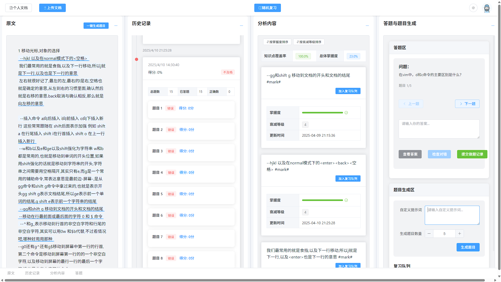

# 复习管理平台

##  基本介绍

Review Manager 是一个基于 Vue3 和 SpringCloud 的文档复习平台。通过设计符合艾宾浩斯遗忘曲线的遗忘机制，给用户展现直观清晰的文档掌握度记录。并利用deepseek进行针对性出题和做题评价，实现用户自定义的针对复习的计划。

~~[开发文档]()~~ | [在线演示](https://wainyz.online/review/) | [码云(国内镜像)](https://gitee.com/umodoc/editor) 

##  在线体验

访问[https://wainyz.online/review](https://wainyz.online/review)快速体验。

## 开发文档

请访问[https://www.showdoc.com.cn/***REMOVED***](https://www.showdoc.com.cn/***REMOVED***)。

##  设计理念

## 安装教程

